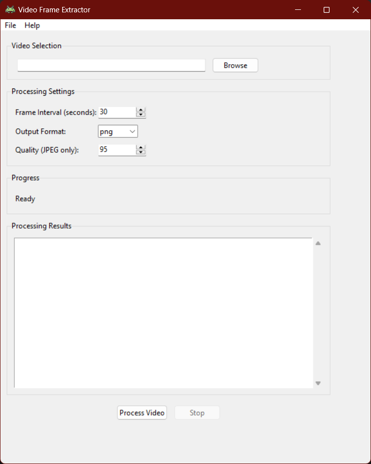

# Video-Frame-Extractor

<div align="center">


[](LICENSE)
[](https://github.com/mintzic/Video-Frame-Extractor/releases)

[](https://www.python.org/downloads/)

A user-friendly desktop application for extracting frames from videos at specified intervals.

[Features](#features) • [Installation](#installation) • [Usage](#usage) • [Development](#development) • [Contributing](#contributing)

</div>

## Features

- 🎥 **Multiple Format Support**: Works with MP4, AVI, MOV, MKV, and other common video formats
- ⚙️ **Customizable Extraction**: Set custom intervals for frame extraction
- 🖼️ **Flexible Output**: Choose between PNG and JPG formats with quality settings
- 📊 **Progress Tracking**: Real-time progress updates and detailed processing reports
- 🛑 **Process Control**: Pause or stop extraction at any time
- 📁 **Organized Output**: Automatic file organization and naming

## Screenshots

<div align="center">

</div>

## Installation

### Quick Install

1. Download the latest installer from the [Releases](https://github.com/yourusername/video-frame-extractor/releases) page
2. Run `VideoFrameExtractorSetup.exe`
3. Follow the installation wizard
4. Launch from your desktop or start menu

### Portable Version

1. Download `VideoFrameExtractor-portable.zip`
2. Extract to your preferred location
3. Run `VideoFrameExtractor.exe`

### System Requirements

- Windows 10 or later
- 4GB RAM (8GB recommended)
- 100MB free disk space (plus space for extracted frames)

## Usage

### Basic Operation

1. Launch Video Frame Extractor
2. Click "Browse" to select your video file
3. Configure extraction settings:
   - Frame Interval (seconds)
   - Output Format (PNG/JPG)
   - Quality Settings (for JPG)
4. Click "Process Video"
5. Find extracted frames in the "processed_output" folder

### Advanced Features

- **Quality Control**: Adjust JPG compression (1-100)
- **Process Management**: Stop/resume processing
- **Output Organization**: Automatic frame naming and folder structure
- **Processing Report**: JSON report with extraction details

## Development

### Setup Development Environment

```bash
# Clone the repository
git clone https://github.com/mintzic/Video-Frame-Extractor.git
cd Video-Frame-Extractor

# Create virtual environment
python -m venv .venv

# Activate virtual environment
# Windows:
.venv\Scripts\activate
# Unix/MacOS:
source .venv/bin/activate

# Install dependencies
pip install -r requirements.txt
```

### Project Structure

```
video-frame-extractor/
├── main.py              # Main application entry
├── video_processor.py   # Core video processing logic
├── config.py           # Configuration settings
├── requirements.txt    # Python dependencies
├── resources/         # Icons and resources
└── docs/             # Documentation
```

### Building from Source

```bash
# Install PyInstaller
pip install pyinstaller

# Build executable
python build.py
```

Or

```bash
# Windows
.\build.bat
```

The executable will be created in the `dist` folder.

## Contributing

Contributions are welcome! Here's how you can help:

1. Fork the repository
2. Create your feature branch (`git checkout -b feature/AmazingFeature`)
3. Commit your changes (`git commit -m 'Add some AmazingFeature'`)
4. Push to the branch (`git push origin feature/AmazingFeature`)
5. Open a Pull Request

Please read [CONTRIBUTING.md](CONTRIBUTING.md) for details on our code of conduct and submission process.

## License

This project is licensed under the MIT License - see the [LICENSE](LICENSE) file for details.

## Acknowledgments

- Built with [MoviePy](https://zulko.github.io/moviepy/)
- UI powered by [Tkinter](https://docs.python.org/3/library/tkinter.html)
- Icon made by [Those Icons]

## Contact

xanderkur - [@xanderkur24](https://x.com/xanderkur24)

Project Link: [https://github.com/mintzic/Video-Frame-Extractor.git](https://github.com/mintzic/Video-Frame-Extractor.git)

## Support

If you find this project useful, please consider giving it a ⭐️!

---

<div align="center">
Made with ❤️ by Mintzic
</div>
